# Credential Revocation - High-Level Proposed Design

## Inji Certify Plugin Architecture

The **Inji Certify** platform follows a modular and extensible architecture to support credential issuance through pluggable data provider components. This design ensures flexibility, adaptability across multiple data sources, and adherence to open standards like **OpenID for Verifiable Credential Issuance (OpenID4VCI)**. The core architecture consists of the following key actors and interaction stages:

### 🔑 1. Authentication

The flow begins with the **Wallet** initiating user authentication by interacting with an **OAuth2.0-compliant Authorization Server**. Upon successful authentication, the wallet receives an **Access Token**, which is used to authorize further requests to Inji Certify.

### 🧾 2. Credential Request Handling

The Wallet sends a **credential request** to Inji Certify’s `/credential` endpoint, including the access token. Inji validates the request and uses the token to extract relevant **user metadata**, such as user ID, claims, or authorization scopes.

### 🔌 3. Plugin Invocation

Inji then invokes a **Data Provider Plugin**, passing along the extracted user metadata. Each plugin acts as a bridge to a specific **Issuer Data Source**, encapsulating the logic needed to query external systems or APIs (e.g., via HTTP or other custom protocols).

### 🗃️ 4. Data Retrieval & Transformation

The plugin communicates with the **issuer’s backend or database** to fetch the user’s data. Upon receiving a response, the plugin transforms the raw data into a **structured JSON format** that aligns with the VC template requirements and returns it to Inji.

### 📜 5. Verifiable Credential Generation

Using the formatted data, Inji applies it to a predefined **Verifiable Credential (VC) template**. The VC is created in accordance with **W3C standards**, ensuring semantic interoperability and compliance.

### 👜 6. Credential Issuance

Finally, Inji issues the fully generated **verifiable credential** back to the Wallet using the **OpenID4VCI protocol**, completing the issuance workflow.

```mermaid
    sequenceDiagram
    %% Participant Definitions with Icons
    participant Wallet as 👜 Wallet
    participant AuthServer as 🔐 Auth Server (OAuth2.0)
    participant Inji as 📜 Inji Certify
    participant Plugin as 🔌 Data Provider Plugin
    participant Issuer as 🗃️ Issuer Data Source


    %% Step 1: Auth
    Wallet->>AuthServer: 1️⃣ User Authentication
    AuthServer-->>Wallet: 2️⃣ Respond with Access Token


    %% Step 2: Credential Request
    Wallet->>Inji: 3️⃣ POST /credential with Access Token


    %% Step 3: Inji internal processing
    Inji->>Inji: 4️⃣ Extract User Metadata Using Token


    %% Step 4: Plugin fetches user data
    Inji->>Plugin: 5️⃣ Invoke passing User Metadata
    Plugin->>Issuer: 6️⃣ Query for User Data (HTTP/custom)
    Issuer-->>Plugin: 7️⃣ Respond with User Data
    Plugin-->>Inji: 8️⃣ Return Formatted Data (JSON)


    %% Step 5: VC Generation
    Inji->>Inji: 9️⃣ Apply Data to VC Template


    %% Step 6: VC Issuance
    Inji-->>Wallet: 🔟 Issue Verifiable Credential


    %% Note on protocol
    note over Wallet,Inji: All interactions use OpenID4VCI protocol 📘
```

## Credential Revocation Feature Design

The **Inji Certify** platform includes a robust and standards-aligned design for **Verifiable Credential (VC) revocation**, ensuring that issued credentials can be selectively invalidated when necessary. This design spans two critical flows:

- **Revocation-aware credential issuance**
- **Administrative revocation workflows**

### 1. 🔁 Credential Issuance with Revocation Metadata

This flow enhances the core issuance process to support future revocation by assigning revocation identifiers during credential generation.

#### Key Steps:

- **Authentication & Request**:  
  The user authenticates via an **OAuth2.0 flow**, and the Wallet submits a credential request to Inji.

- **Data Retrieval**:  
  As in the core plugin-based architecture, Inji retrieves user data via the **Data Provider Plugin** from the issuer’s backend.

- **VC Preparation**:
  - Inji assigns a **unique revocation index** to the credential, used to track revocation status.
  - Metadata, including `statusListId` and `revocationIndex`, is stored in a **Ledger Table** within the Inji system.

- **Credential Issuance**:  
  The credential, embedded with the **revocation index** and **status list reference**, is returned to the Wallet via **OpenID4VCI**.

This setup ensures that every credential has an associated, queryable **revocation handle** without introducing on-chain complexity.

```mermaid
sequenceDiagram
    %% Participant Definitions with Icons
    participant Wallet as 👜 Wallet
    participant AuthServer as 🔐 Auth Server (OAuth2.0)
    participant Inji as 📜 Inji Certify
    participant Ledger as 📒 Ledger Table
    participant Plugin as 🔌 Data Provider Plugin
    participant Issuer as 🗃️ Issuer Data Source


    %% Step 1: Auth
    Wallet->>AuthServer: 1️⃣ User Authentication
    AuthServer-->>Wallet: 2️⃣ Respond with Access Token


    %% Step 2: Credential Request
    Wallet->>Inji: 3️⃣ POST /credential with Access Token


    %% Step 3: Inji internal processing
    Inji->>Inji: 4️⃣ Extract User Metadata Using Token


    %% Step 4: Plugin fetches user data
    Inji->>Plugin: 5️⃣ Invoke passing User Metadata
    Plugin->>Issuer: 6️⃣ Query for User Data (HTTP/custom)
    Issuer-->>Plugin: 7️⃣ Respond with User Data
    Plugin-->>Inji: 8️⃣ Return Formatted Data (JSON)


    %% Step 5: VC Generation
    Inji->>Inji: 9️⃣ Apply Data to VC Template
    Inji->>Ledger: 🔟 Assign a unique revocation index<br> & store metadata with configured data attributes


    %% Step 6: VC Issuance
    Inji-->>Wallet: 1️⃣1️⃣ Issue Verifiable Credential


    %% Note on protocol
    note over Wallet,Inji: All interactions use OpenID4VCI protocol 📘
```

### 2. 🛑 Credential Revocation Workflow

This flow describes how an **Issuer Admin** can revoke previously issued credentials and how **verifiers** can subsequently check revocation status.

#### Step-by-Step Breakdown:

##### 🔍 Step 1: Admin Lookup

- The Issuer Admin queries **Inji Certify** using a **search API**, filtering credentials based on preconfigured attributes (e.g., Roll Number, document number).
- Inji queries the **Ledger Table** to retrieve matching credentials.
- The system returns `credentialId`, `statusListId`, and `revocationIndex` for each result.

##### 🚫 Step 2: Revocation Trigger

- The admin issues **revoke API calls** for selected credentials, passing the associated `statusListId` and `revocationIndex`.
- Inji **queues these requests for asynchronous processing** to avoid blocking admin interactions.

##### 📝 Step 3: Revocation Status Update

- Inji marks the corresponding indices as **revoked** in a **Revocation Status Credential**, which follows W3C status list credential standards.
- This updated credential is **digitally signed and published**, enabling public consumption by verifiers.

---

### 3. ✅ Verifier Interaction

In a separate flow, when a **Verifier** receives a credential from a user:

- The Verifier **fetches the Revocation Status Credential** using the `statusListId` embedded in the VC.
- Using the `revocationIndex`, the Verifier **checks whether the credential is still valid**.

This lookup is **stateless and privacy-preserving**, aligning with decentralized identity standards.

```mermaid
sequenceDiagram
    participant 🧑‍💼 Issuer Admin
    participant 📜 Inji Certify
    participant 📒 Ledger Table
    participant 🧾 Revocation Status Credential
    participant 🧪 Verifier


    note over 🧑‍💼 Issuer Admin: Step 1: Search for credentials to revoke
    🧑‍💼 Issuer Admin->>📜 Inji Certify: Fetch API call to search using configured data attribute
    📜 Inji Certify->>📒 Ledger Table: Query DB
    📒 Ledger Table-->>📜 Inji Certify: Filtered records
    📜 Inji Certify-->>🧑‍💼 Issuer Admin: Return credentialId, statusListId, index


    note over 🧑‍💼 Issuer Admin: Step 2: Revoke filtered credentials
    loop For each credential
        🧑‍💼 Issuer Admin->>📜 Inji Certify: Revoke API call (statusListId, index)
    end


    note over 📜 Inji Certify: Step 3: Asynchronously update revocation status
    📜 Inji Certify-->>🧾 Revocation Status Credential: Mark index as revoked
    📜 Inji Certify->>🧾 Revocation Status Credential: Sign and publish revocation status credential


    note over 🧪 Verifier: Different flow – when verifier receives credential from user


    🧪 Verifier-->>🧾 Revocation Status Credential: Fetch the revocation status credential
    🧪 Verifier->>🧪 Verifier: Check if credential is revoked based on index

```

