# Data Integrity Proof Data Feature

## Overview

The Data Integrity Proof suite provides cryptographic proof mechanisms for Verifiable Credentials (VCs) using the Data Integrity Proof standard. This feature is essential for ensuring the authenticity and integrity of credentials issued by Inji Certify.

## Supported Algorithms

The following signature algorithms are supported by the `Data Integrity Proof` suite:

- **ecdsa-rdfc-2019**
- **ecdsa-jcs-2019**
- **eddsa-rdfc-2022**
- **eddsa-jcs-2022**

Supported signature algorithms for these crypto suites include: 
- **ES256** (ECDSA using P-256 and SHA-256)
- **ES256K** (ECDSA using secp256k1 and SHA-256)
- **EdDSA** (Edwards-Curve Digital Signature Algorithm)

> **Note:** The list of supported algorithms may be extended in future releases. Always refer to the latest [API documentation](https://mosip.stoplight.io/docs/inji-certify) for updates.

## Sequence Diagram for credential issuance with Data Integrity Proof

```mermaid
sequenceDiagram
    participant Client as 🌐 Client
    box Inji Certify #E6F3FF
    participant CredentialAPI as 🔗 Credential API
    participant CredentialConfiguration as ⚙️ Credential Configuration
    participant DataProviderPlugin as 🔌 Data Provider Plugin
    participant VelocityTemplatingEngine as ⚙️ Velocity Templating Engine
    participant W3CJsonLdCredential as 🔐 W3CJsonLdCredential
    participant DataIntegrityLib as 🛡️ DataIntegrity Lib
    participant KeyManager as ✍️ KeyManager
    end

    Client->>CredentialAPI: Request VC Issuance (format: ldp_vc)

    CredentialAPI->>CredentialConfiguration: Validate request & get config
    CredentialConfiguration-->>CredentialAPI: Return success & config (with signatureCryptoSuite)

    CredentialAPI->>DataProviderPlugin: Request data
    DataProviderPlugin-->>CredentialAPI: Return raw data

    CredentialAPI->>VelocityTemplatingEngine: Format raw data with template
    VelocityTemplatingEngine-->>CredentialAPI: Return unsigned credential data

    CredentialAPI->>W3CJsonLdCredential: Instantiate with unsigned data

    CredentialAPI->>W3CJsonLdCredential: addProof()

    W3CJsonLdCredential->>DataIntegrityLib: Generate DataIntegrityProof (with signatureCryptoSuite)
    DataIntegrityLib->>KeyManager: Sign credential data
    KeyManager-->>DataIntegrityLib: Return signature
    DataIntegrityLib-->>W3CJsonLdCredential: Return DataIntegrityProof object

    W3CJsonLdCredential-->>CredentialAPI: Return signed VC with proof

    CredentialAPI-->>Client: Return final ldp_vc
```

## Usage Notes

- The `signatureCryptoSuite` property must be set to one of supported Data Integrity proof algorithms in the credential configuration to use this suite.
- The `signatureAlgo` property is mandatory and must match one of the supported algorithms. For example, signatureAlgo should be set to `ES256` or `ES256K` for supporting `ecdsa-rdfc-2019`, `ecdsa-jcs-2019` crypto suites.
- If an unsupported algorithm is provided, Inji Certify will return an error during configuration validation.

## References

- [W3C Data Integrity Proofs](https://www.w3.org/TR/vc-data-integrity/)
- [Inji Certify Credential Issuer Configuration](./Credential-Issuer-Configuration.md)

---
