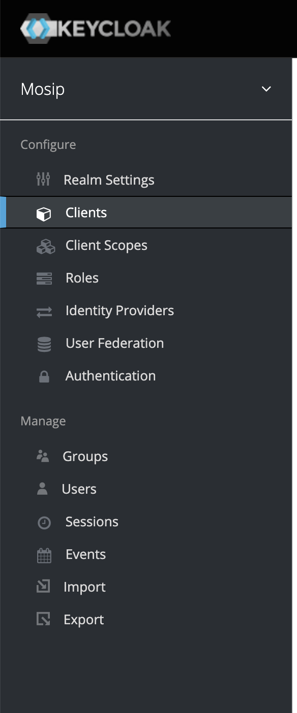

# Using Certify with KeyCloak as an AuthZ service

Guide a dev/integrator to use compatible version of Inji Certify to integrate KeyCloak as an Authorization service for VC Issuance. This document is strictly to showcase how other AuthZ services can be used  with Certify for the purposes of VC Issuance and does not cover all necessary security guidelines. The Certify developers have tested this with Keycloak 26 and it may work with other standards compliant AuthZ providers.

## Pre-requisite:

1. A configured Keycloak setup(replace this with another compatible AuthZ setup)
2. A working Inji Certify setup with an appropriate VC Plugin

## Steps

### 1. Keycloak Configuration

1. Login into Keycloak and create a "Client" in Keycloak, check for the "Clients" option on the sidebar as shown in 
    - the "Access Type" should be `public`
    - add "Valid Redirect URIs" to the appropriate values or keep it to `*` for testing purposes, do change it later
    - set "Enabled" to true
    - configure
2. Create a "client scope" in Keycloak with the same scope name as the one configured in Certify Well Known
    - set the "Protocol" to be `openid-connect`
    - set "Include In Token Scope" to `true`
    - Create mappers with the "token claim name" of `aud` & `client_id` with the relevant details and set "Add to access token" to `true`.

### 2. Configure Certify

1. Set the Authorize URL of Certify to point to the KeyCloak Authorization server, i.e. `mosip.certify.authorization.url` and configure the `mosip.certify.authn.issuer-uri` & `mosip.certify.authn.jwk-set-uri` appropriately.
2. Configure `mosip.certify.identifier` to the value matching the `aud` value configured in the client.
3. Configure the scope correctly as per the scope of the VerifiableCredential as configured in the Keycloak client in the prior steps.
4. Configure the credential types to match the VC in the well known
5. Add and configure your VC Plugin and configure it's properties
6. Generate an Authorization token via Keycloak and try to download a VC from Certify using the relevant [Postman collections](./postman-collections/) or via another standards compliant interface.
