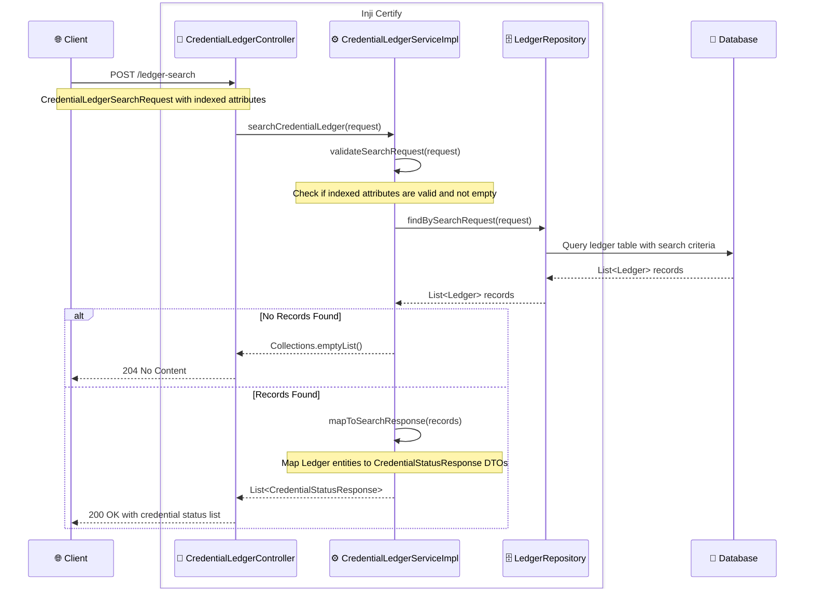

## Ledger Issuance and Ledger Search
This document provides an overview of the ledger issuance process and how to perform ledger searches effectively.

## Ledger Issuance
Ledger issuance refers to the process of creating a new ledger entry while a Verifiable Credential (VC) is being issued. When a VC is issued with ledger issuance enabled, a corresponding ledger entry is created that includes essential details about the issued credential. This ledger entry typically contains the following information:
 - `credentialId`: Unique identifier of the issued credential.
 - `issuerId`: Identifier of the issuer who issued the credential.
 - `credentialType`: Type(s) of the issued credential.
 - `issuanceDate`: Date and time when the credential was issued.
 - `indexedAttributes`: Key-value pairs of subject claims that are indexed for efficient searching.

### Credential Status Details in Ledger
 - The ledger entry also contains credential status details (including status purpose, status list index, and status list credential URL), which allows tracking and managing the status of the issued credentials. 
 - The availability of credential status is subject to the allowed status purposes set in the credential configuration. The issuer can enable or disable the status purposed based on their business requirements.
 - To read more about credential status purposes, refer to the [`credentialStatusPurposes` Support](./VC-`credentialStatusPurposes`-Support.md) documentation.
 - To read about configuring allowed status purposes, refer to the [Credential Configuration](./Credential-Issuer-Configuration.md#configuration-properties) documentation.

## Ledger Issuance Flow
When a VC is issued, the following steps are typically involved in the ledger issuance process:
1. **Credential Creation**: The issuer creates the Verifiable Credential containing the necessary claims about the subject.
2. **Ledger Entry Preparation**: The issuer prepares a ledger entry that includes the credential data like `credentialId`, `issuerId`, `credentialType`, `issuanceDate` etc.
3. **Indexed Attributes**: The issuer may also include indexed attributes in the ledger entry to facilitate efficient searching later. These attributes include subject claims data through configurations.
 - **Eg.** If the `credentialSubject` of VC is like below:
    ```json
        {
          "credentialSubject": {
            "qualifications": [
              {"degree": "B.Tech", "year": "2020"},
              {"degree": "M.Tech", "year": "2022"}
            ],
            "skills": ["Java", "Python", "Spring Boot"]
          }
        }
    ```

 - Then for above VC subject claims, the indexed attributes can be configured as:
    ```
        mosip.certify.indexed-mappings.allQualifications=$.credentialSubject.qualifications
        mosip.certify.indexed-mappings.latestDegree=$.credentialSubject.qualifications[-1].degree
        mosip.certify.indexed-mappings.firstSkill=$.credentialSubject.skills[0]
        mosip.certify.indexed-mappings.allSkills=$.credentialSubject.skills
    ```

 - The result in ledger will be like:
    ```json
        {
          "allQualifications": [
            {"degree": "B.Tech", "year": "2020"},
            {"degree": "M.Tech", "year": "2022"}
          ],
          "latestDegree": "M.Tech",
          "firstSkill": "Java",
          "allSkills": ["Java", "Python", "Spring Boot"]
        }
    ```

## Enabling and Disabling Ledger Issuance
Ledger issuance can be enabled or disabled based on the following configuration. 
```
    mosip.certify.issuer.ledger-enabled=true
```
The following points should be considered when enabling or disabling ledger issuance:
 - This config will enable or disable the ledger entries for issued credentials.
 - When the `credentialStatusPurposes` is not enabled for a vc-type but ledger is enabled, Credential Status Detail field in ledger will be empty.
 - When the `credentialStatusPurposes` is enabled for a vc-type but ledger is disabled, then the user should have their own mechanism to identify the statusListCredentialId and statusListIndex.
 - Enabling the ledger flag is highly recommended to search for the issued credentials.

## Ledger Search
 - Ledger search allows users to query the ledger for specific credentials based on various criteria. 
 - The response retrieved from the ledger search can be used as a reference for updating the credential status.
 - Refer to the [Update Credential Status API](./VC-Revocation-Support.md#how-it-works) Point No. `3` documentation for more details on how to use the ledger search results.
 - Ledger entries can be retrieved using `/ledger-search` endpoint to get the status information and other details.

**Sample request of ledger search**:
```json
{
  "credentialId": "afce16e8-02ac-4210-80d9-a0a20132bda3",
  "issuerId": "did:web:sample.github.io:my-files:sample",
  "credentialType": "FarmerCredential,VerifiableCredential",
  "indexedAttributesEquals": {
    "key1": "Bengaluru",
    "key2": "Karnataka"
  }
}
```

**Sample response of ledger search**:
- `/ledger-search`
```json
  [
    {
      "credentialId": "afce16e8-02ac-4210-80d9-a0a20132bda3",
      "issuerId": "did:web:sample.github.io:my-files:sample",
      "statusListCredentialUrl": "7bf52e81-f3bb-40ec-a0f9-a714847fd067",
      "statusListIndex": 5,
      "statusPurpose": "revocation",
      "issueDate": "2025-08-07T11:57:39",
      "credentialType": "MockVerifiableCredential,VerifiableCredential",
      "statusTimestamp": "2025-08-07T11:57:39"
    }
  ]
```

- `/v2/ledger-search`
```json
    [
      {
        "credentialId": "afce16e8-02ac-4210-80d9-a0a20132bda3",
        "issuerId": "did:web:sample.github.io:my-files:sample",
        "statusListCredentialUrl": "7bf52e81-f3bb-40ec-a0f9-a714847fd067",
        "statusListIndex": 5,
        "statusPurpose": "revocation",
        "issuanceDate": "2025-08-07T11:57:39",
        "credentialType": "MockVerifiableCredential,VerifiableCredential",
        "statusTimestamp": "2025-08-07T11:57:39"
      }
    ]
```

**Important:** The v1 `/ledger-search` API uses issueDate for issuance, while v2 `/v2/ledger-search` uses issuanceDate for improved field consistency; both return credential and status details for search queries. Overall the response structure remains the same.

**Ledger Test Scenarios**
- When `credentialId` is not provided during ledger search, the system returns all credentials matching the other criteria along with their status information.
- `credentialId` is same as the `id` of the issued VC. So if the VC does not have id, then `credentialId` in ledger will be null.
- If statusList is not enabled, then `credentialStatusDetail` will be empty for such credentials.

**Sequence diagram for Ledger Search** :


### Conclusion
Ledger issuance and search are crucial components of the credential management system. By enabling ledger issuance, issuers can ensure that all issued credentials are securely recorded on the ledger. Ledger search functionality allows users to efficiently retrieve credential information based on various criteria, facilitating effective credential status management.