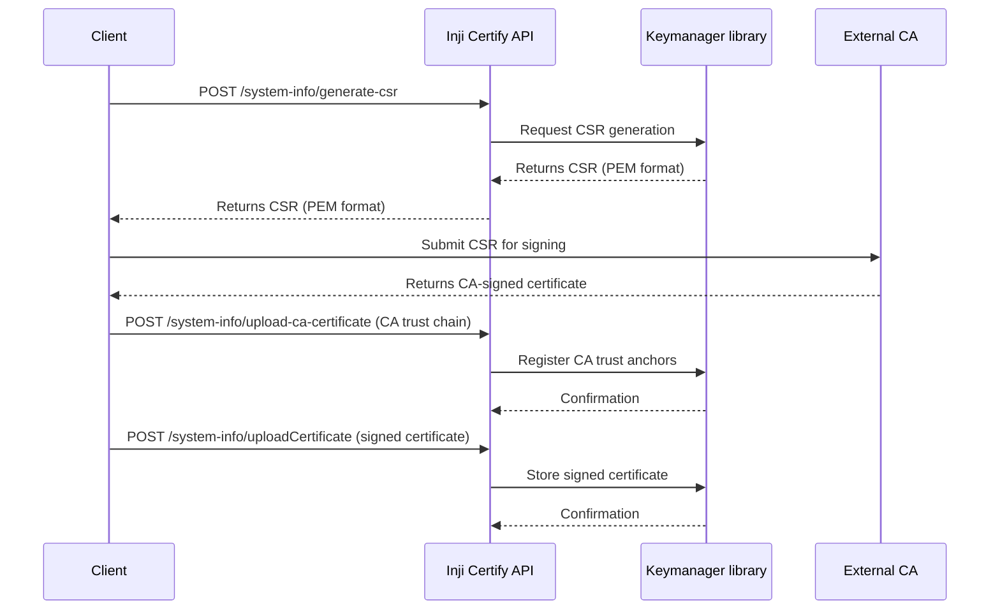

# Support for Public Key Infrastructure (PKI) and Its Integration with SD-JWT(IETF format vc+sd-jwt) Verifiable Credentials
Inji Certify allows issuers to integrate their own CA-signed certificates into the credential signing pipeline. This workflow guides you through the complete setup—from generating a CSR to uploading the signed certificate—so that all Verifiable Credentials (VCs) are signed using your institution’s PKI.

## Overview
When using an external CA, the system must be configured with:
- A Certificate Signing Request (CSR) generated by Inji Certify.
- The CA’s root/intermediate certificate.
- The externally signed certificate.

Once configured, the Key Manager will generate and manage keys tied to the uploaded certificates and use them to sign Verifiable Credentials.

## VC Signing with External CA-Signed Certificates
Inji Certify supports the use of externally issued, CA-signed certificates for credential signing, enabling issuers to integrate their own `Public Key Infrastructure (PKI)` into the credential issuance workflow.

### Trust Element: Public Key Infrastructure (PKI)
PKI is the one of the important ways to get digital trust. It uses cryptographic keys and certificates to verify the authenticity and integrity of digital credentials.
- **Root CA Trust Anchor:** The root certificate authority (CA) acts as the ultimate trust anchor. All certificates in the chain must trace back to this trusted root, which is recognized by relying parties.
- **Certificate Chain Validation:** When a credential is signed, its signature can be validated by checking the certificate chain up to the root CA. This ensures the credential was issued by a legitimate authority.
- **Revocation and Expiry:** PKI supports certificate revocation and expiry, allowing issuers to invalidate compromised or outdated certificates, maintaining trust over time.
- **Interoperability:** Using PKI enables credentials to be trusted across different systems and organizations, as long as they recognize the same CA.
- **Security:** PKI ensures that only authorized entities (with access to the private key corresponding to the CA-signed certificate) can issue valid credentials.

### Why it matters:
By allowing institutions or countries to bring their own CA-signed certificates, Certify ensures seamless alignment with existing national or organizational trust frameworks. This flexibility strengthens trust, simplifies compliance, and makes it easier for adopters to integrate Certify into their broader security ecosystem.

### How it works:
- **Bring-Your-Own Certificate:** Administrator can generate CSR through Inji Certify, use CSR to get CA-signed certificate through their system. After that administrator can upload a CA-signed certificate into Inji Certify. The system then generates the signing key material using the uploaded certificate.
- **Integrated Signing Pipeline:** Once configured, Certify uses the externally signed certificate to sign every Verifiable Credential it issues, ensuring all credentials reflect the issuer’s trusted PKI hierarchy.
- **Key Manager Integration:** Certify works in tandem with the Key Manager to store, manage, and apply the uploaded certificate and associated keys securely throughout the issuance process.

## PKI Implementation in SD-JWT VCs issued by Inji Certify
Importance of PKI in SD-JWT
1. **Credential Authenticity:** PKI enables issuers to sign SD-JWTs with private keys linked to CA-signed certificates, ensuring credentials are genuine and originate from trusted sources.
2. **Trust Anchoring:** The certificate chain allows verifiers to trace the issuer’s identity back to a recognized root CA, establishing a clear trust anchor.
3. **Revocation and Expiry:** PKI supports mechanisms for certificate revocation and expiry, allowing compromised or outdated credentials to be invalidated.
4. **Interoperability:** Standard PKI enables SD-JWT credentials to be verified across different systems and organizations that trust the same CA.
5. **Compliance:** Using PKI helps meet regulatory and industry requirements for secure, auditable digital credential management.

This approach ensures that every SD-JWT VC issued by Inji Certify is cryptographically verifiable and anchored to the issuer’s PKI trust framework.

### Checking Trust Elements in SD-JWT
1. **Inspect the x5c Certificate Chain:** Users should extract the x5c field from the SD-JWT header. This field contains the certificate chain (in base64-encoded DER format) used to sign the JWT.
2. **Validate Certificate Chain:** Verify that each certificate in the x5c array is properly signed by the next certificate up to the root CA. This ensures the chain is unbroken and trusted.
3. **Check Root CA Trust:** Confirm that the root certificate in the chain matches a trusted CA in the verifier’s trust store.
4. **Verify Certificate Expiry and Revocation:** Check the validity period of each certificate and consult revocation lists (CRL/OCSP) to ensure none are expired or revoked.
5. **Confirm Signature:** Use the public key from the leaf certificate (first in x5c) to verify the SD-JWT’s digital signature.
6. **Match Issuer Identity:** Ensure the certificate subject matches the expected issuer identity for the SD-JWT.

These steps help users confirm the authenticity, integrity, and trustworthiness of SD-JWT credentials using PKI-backed certificate chains.

### Key Benefits:
- **Trust Alignment:** Credentials are signed using the issuer’s own CA-backed certificates, reinforcing alignment with local or institutional PKI policies.
- **Greater Adoption Flexibility:** Countries and organizations can adopt Certify without restructuring their existing certificate management models.
- **Seamless Compliance:** Using a recognized CA certificate simplifies audits and compliance checks by matching established trust and governance frameworks.
- **End-to-End Security:** The signing process remains fully managed through the Key Manager, ensuring secure key handling while maintaining issuer-specific trust anchors.

## Workflow Steps
1. **Generate a Certificate Signing Request (CSR):**
   Generate a CSR that must be signed by your external Certificate Authority.

```
    POST `/system-info/generate-csr`
```

- Produces a Certificate Signing Request (CSR) data, typically in PEM format.
- Must be submitted to your CA for signing.
- CA returns a signed certificate based on this CSR.


2. **Upload the CA Certificate:**
   Upload the CA’s trust chain (root and/or intermediate certificates).

```
    POST `/system-info/upload-ca-certificate`
```

- Registers the CA’s trust anchors.
- Allows Certify to validate the certificate chain for VC signing.


3. **Upload the Signed Certificate:**
   Upload the externally signed certificate received from the CA.

```
    POST `/system-info/uploadCertificate`
```

- Stores the CA-signed certificate as the active signing certificate.
- Enables the Key Manager to use it for signing VCs.
- Integrates the certificate into the ongoing key lifecycle.

## Sequence Diagram for CSR generation and Certificate Upload



## System Behavior After Configuration
Once all three steps are completed:
- The Key Manager manages signing keys derived from the uploaded certificates.
- All VCs issued by Inji Certify are signed using the externally provided CA-backed certificate.
- Issuers maintain alignment with their existing national or institutional PKI.

## Limitations & Important Considerations
### Certificate Expiry Handling
- Inji Certify does not automatically manage or renew externally signed certificates.
- If the uploaded certificate expires, the Key Manager will fallback to using a self-signed certificate and regenerate the keys accordingly.
- To avoid unintended fallback behavior and ensure uninterrupted trust alignment, issuers must:
  **Upload a new externally signed certificate before the current certificate expires.**

*The above steps ensure that credential signing continues using the intended CA-signed certificate without disruption.*