# Verifiable Credential Issuance with Presentation During Issuance

This document outlines the process for Verifiable Credential (VC) issuance, particularly focusing on scenarios requiring a "Presentation During Issuance" by the user.

## Problem Statement: The Need for Presentation During Issuance

In many credential issuance scenarios, an issuer needs to verify certain attributes or existing credentials of a user *before* issuing a new credential. For example, to issue a "Proof of Employment" credential, an employer (issuer) might first require the individual (user) to present their "Identity Card" credential and perhaps a "Signed Contract" document. This pre-issuance verification, often facilitated by a Verifiable Presentation, ensures the user meets the necessary prerequisites and provides cryptographically verifiable proof of their eligibility. Without this step, issuers might lack sufficient assurance or rely on less secure, non-standardized methods to validate prerequisite conditions, potentially leading to the issuance of credentials based on unverified or weakly verified claims. Presentation during issuance addresses this by integrating a formal verification step into the issuance flow.

## Solution Overview

The solution involves a multi-phase interaction between the User's Wallet, the Credential Issuer (Inji Certify), and a VP Verifier. The Wallet first discovers the Issuer's capabilities. Then, upon an initial credential request, if the Issuer's policy dictates, it triggers a presentation flow. The Wallet interacts with the VP Verifier to present the required existing credentials. Once verified, the Wallet continues the authorization process with the Issuer, exchanges an authorization code for tokens, and finally requests and receives the new Verifiable Credential. This ensures that credentials are only issued after appropriate prerequisite verifications have been successfully completed.

## The Actors

The issuance process involves communication between four key participants:

* **User**: The individual who requests a new credential and provides consent to share existing credentials from their Wallet.

* **Wallet**: The user's agent (e.g., a mobile app) that stores their credentials, manages interactions with other systems, and requests new credentials on the user's behalf.

* **Inji Certify (VCI)**: The Credential Issuer. This system is responsible for issuing new verifiable credentials after validating the user's eligibility. It also acts as an OAuth Authorization Server.

* **VP Verifier**: A service that formally requests and verifies a Verifiable Presentation (VP) from the user's wallet to confirm they meet certain criteria. This is often based on OpenID4VP.

## Sequence Diagram

```mermaid
sequenceDiagram
    participant W as 👜 Wallet
    participant IC as 🛡️ Inji Certify<br/>(OAuth AS + VCI)
    participant IVP as 🕵️ VP Verifier (openid4vp)<br/>
    participant U as 👤 User

    Note over W,IC: 0. Discovery
    W->>IC: 1. GET /.well-known/openid-credential-issuer
    IC-->>W: 2. Credential Issuer metadata
    W->>IC: 3. GET /.well-known/oauth-authorization-server
    IC-->>W: 4. OAuth AS metadata 
    
    Note over W,IC: 1. Initial Credential Request (Browser-less)
    W->>IC: 5. POST /authorize-challenge<br/>{client_id, authorization_details(auth_session)}
    IC->>IVP: 6. Create presentation request
    IVP-->>IC: 7. {request_id,transaction_id, request_uri: /oid4vp/request/{id}} (non-normative)
    IC->>IC: 8. store transaction id for the presentation request mapped to Auth Session
    IC-->>W: 9. 400 insufficient_authorization<br/>{auth_session, presentation: {request_uri}}
    
    Note over W,IVP: 2. Presentation Flow
    W->>IVP: 10. GET /oid4vp/request/{request_id}
    IVP-->>W: 11. Presentation Request
    W->>U: 12. User consent
    U-->>W: 13. Approve
    W->>IVP: 14. POST /oid4vp/response<br/>{vp_token, presentation_submission}
    IVP->>IVP: 15. Store verification result
    
    
    Note over W,IC: 3. Continue with Inji Certify
    W->>IC: 17. POST /authorize-challenge<br/>{auth_session}
    IC->>IC: 18. Validate auth_session 
    IC->>IVP: 19. get VP verification status for transaction id
    IVP->>IC: 20. Send VP verification status
    IC->>IC: 21. VC is Valid (positive flow)
    IC-->>W: 22. 200 OK {authorization_code}
    
    W->>IC: 23. POST /oauth/token<br/>{grant_type=authorization_code, code}
    IC-->>W: 24. {access_token, c_nonce}
    
    W->>IC: 25. POST /credential<br/>{format, proof}
    IC-->>W: 26. {credential}
```

## Verifiable Credential Issuance Flow (Detailed Steps)

The process is broken down into several key phases:

### Phase 0: Discovery

The Wallet discovers the Credential Issuer's (Inji Certify) capabilities.

1. **Wallet to Inji Certify**: `GET /.well-known/openid-credential-issuer` (The Wallet requests Inji Certify's OpenID Credential Issuer metadata).

2. **Inji Certify to Wallet**: Returns Credential Issuer metadata.

3. **Wallet to Inji Certify**: `GET /.well-known/oauth-authorization-server` (The Wallet requests Inji Certify's OAuth Authorization Server metadata).

4. **Inji Certify to Wallet**: Returns OAuth AS metadata.

### Phase 1: Initial Credential Request & Presentation Trigger

The Wallet initiates the request, and the Issuer determines if a presentation is needed.
5.  **Wallet to Inji Certify**: `POST /authorize-challenge` (Includes `client_id`, `authorization_details` for the desired credential).
6.  **Inji Certify (Internal)**: Evaluates its presentation policy.
7.  **Inji Certify to VP Verifier**: Instructs the VP Verifier to create a presentation request.
8.  **VP Verifier to Inji Certify**: Returns `request_id`, `transaction_id`, and `request_uri` (e.g., `/oid4vp/request/{id}`). Inji Certify stores `transaction_id` mapped to the Auth Session.
9.  **Inji Certify to Wallet**: Responds with `400 insufficient_authorization`. Includes `auth_session` and `presentation: {request_uri}`.

### Phase 2: Presentation Flow with VP Verifier

The Wallet interacts with the VP Verifier.
10. **Wallet to VP Verifier**: `GET /oid4vp/request/{request_id}` (using the `request_uri`).
11. **VP Verifier to Wallet**: Responds with the Presentation Request details.
12. **Wallet to User**: Prompts User for consent.
13. **User to Wallet**: User approves.
14. **Wallet to VP Verifier**: `POST /oid4vp/response` (submits `vp_token`, `presentation_submission`).
15. **VP Verifier (Internal)**: Stores the verification result.

### Phase 3: Continue Authorization with Inji Certify

The Wallet returns to the Issuer.
17. **Wallet to Inji Certify**: `POST /authorize-challenge` (includes `auth_session` from step 9).
18. **Inji Certify (Internal)**: Validates `auth_session`.
19. **Inji Certify to VP Verifier**: Gets VP verification status for the `transaction_id`.
20. **VP Verifier to Inji Certify**: Sends VP verification status.
21. **Inji Certify (Internal)**: Confirms VC is Valid (positive flow).
22. **Inji Certify to Wallet**: Responds `200 OK` with an `authorization_code`.

### Phase 4: Token Exchange & Credential Issuance

The Wallet gets tokens and then the credential.
23. **Wallet to Inji Certify**: `POST /oauth/token` (grant_type=`authorization_code`, `code`).
24. **Inji Certify to Wallet**: Responds with `access_token`, `c_nonce`.
25. **Wallet to Inji Certify**: `POST /credential` (includes `format`, `proof` with `c_nonce`, authenticated with `access_token`).
26. **Inji Certify to Wallet**: Validates and returns the `credential`.

## Specifications Used

This flow is based on concepts and standards from the following documents:

* [RFC 8414 - OAuth 2.0 Authorization Server Metadata](https://tools.ietf.org/html/rfc8414)

* [OpenID for Verifiable Credential Issuance (OID4VCI) - Draft 15](https://openid.net/specs/openid-4-verifiable-credential-issuance-1_0.html)

* [OAuth 2.0 for First-Party Applications (Implicitly, as part of the OAuth flow)](https://www.ietf.org/archive/id/draft-parecki-oauth-first-party-apps-00.html)

*  [EUDI Wallet Blueprint - Presentation During Issuance (Conceptual basis for the Presentation During Issuance flow)](https://bmi.usercontent.opencode.de/eudi-wallet/eidas-2.0-architekturkonzept/flows/Presentation-During-Issuance/)

* [GitHub issue from OpenID4VCI](https://github.com/openid/OpenID4VCI/issues/473)
---
