# Verifiable Credential Issuance with Presentation During Issuance

This document outlines the process for Verifiable Credential (VC) issuance, particularly focusing on scenarios requiring a "Presentation During Issuance" by the user.

## Problem Statement: The Need for Presentation During Issuance

In many credential issuance scenarios, an issuer needs to verify certain attributes or existing credentials of a user *before* issuing a new credential. 

For example, to issue a "Proof of Employment" credential, an employer (issuer) might first require the individual (user) to present their "Identity Card" credential and perhaps a "Signed Contract" document. This pre-issuance verification, often facilitated by a Verifiable Presentation, ensures the user meets the necessary prerequisites and provides cryptographically verifiable proof of their eligibility. Without this step, issuers might lack sufficient assurance or rely on less secure, non-standardized methods to validate prerequisite conditions, potentially leading to the issuance of credentials based on unverified or weakly verified claims. Presentation during issuance addresses this by integrating a formal verification step into the issuance flow.

## Solution Overview

The solution involves a multiphase interaction between the User's Wallet, the Credential Issuer (Inji Certify), and a VP Verifier. 
The Wallet first discovers the Issuer's and auth server's capabilities. 
Wallet then initiates the authorization by dictating it supports openid4vp_presentation, and redirect_to_web flow. 
Certify interacts with the VP Verifier to create a presentation request, which is then sent back to the Wallet. The Wallet retrieves the presentation request and prompts the User for consent to share existing credentials.
Once VP is verified, Wallet receives the authorization code and exchanges an authorization code for tokens, and finally requests and receives the new Verifiable Credential. This ensures that credentials are only issued after appropriate prerequisite verifications have been successfully completed.

## The Actors

The issuance process involves communication between four key participants:

* **User**: The individual who requests a new credential and provides consent to share existing credentials from their Wallet.

* **Wallet**: The user's agent (e.g., a mobile app) that stores their credentials, manages interactions with other systems, and requests new credentials on the user's behalf.

* **Inji Certify (VCI)**: The Credential Issuer. This system is responsible for issuing new verifiable credentials after validating the user's eligibility. It also acts as an OAuth Authorization Server.

* **VP Verifier**: A service that formally requests and verifies a Verifiable Presentation (VP) from the user's wallet to confirm they meet certain criteria. This is often based on OpenID4VP.

## Sequence Diagram

```mermaid
sequenceDiagram
    participant U as 👤 User
    participant W as 👜 Wallet
    participant IC as 🛡️ Inji Certify<br/>(OAuth AS + VCI)
    participant IVP as 🕵️ VP Verifier (openid4vp)<br/>

    U->>W: Opens the wallet
    Note over W,IC: 0. Discovery
    W->>IC: 1. GET /.well-known/openid-credential-issuer
    IC-->>W: 2. Credential Issuer metadata
    W->>IC: 3. GET /.well-known/oauth-authorization-server
    IC-->>W: 4. OAuth Authorization server(AS) metadata 
    
    Note over W,IC: 1. Authorization to download credential
    W->>IC: 5. POST Content-Type: application/x-www-form-urlencoded /iar<br/>{response_type="code", client_id, code_challenge, code_challenge_method:"S256", redirect_uri, interaction_types_supported=openid4vp_presentation,redirect_to_web}
    IC->>IVP: 6. Create presentation request
    IVP-->>IC: 7. {request_id,transaction_id, {standard ovp request by reference with response_mode as "direct-post" or "direct-post.jwt"}} (non-normative)
    IC->>IC: 8. store transaction id for the presentation request mapped to Auth Session
    Note over IC: Map direct-post to iar-post and direct-post.jwt to iar-post.jwt and construct the response
    IC-->>W: 9. 200 Interactive Authorization Response<br/>{status:"require_interaction", type:"openid4vp_presentation", auth_session:"..random string", openid4vp_request: {standard ovp request by reference with response_mode as "iar-post" or "iar-post.jwt"}}
    
    Note over W,IC: 2. Presentation Flow with Issuer and VP Verifier
    W->>IVP: 10. GET /oid4vp/request/{request_id}
    IVP-->>W: 11. Presentation Request
    W->>W: 12. Display and select credential(s) which satisfies presentation request criteria
    W->>U: 13. User consent
    U-->>W: 14. Approve
    W->>IC: 15. POST Content-Type: application/x-www-form-urlencoded /iar<br/>{auth_session=...&openid4vp_presentation=...}
    IC->>IC: 16. Validate auth_session
    IC->>IVP: 17. POST /oid4vp/response<br/>forward openid4vp_presentation response to verify VP
    IVP->>IVP: 18. verify the VP response
    IVP->>IC: 19. VP verification result (e.g., valid/invalid)
    
    alt If VP is valid 
            IC-->>W: 20. 200 OK {status:"ok", authorization_code:"..."}
            W->>IC: 21. POST /oauth/token<br/>{grant_type=authorization_code, code}
            IC-->>W: 22. {access_token, c_nonce}
            W->>IC: 23. POST /credential<br/>{format, proof}
            IC-->>W: 24. {credential}
    else
            IC-->>W: 20. 400 Bad Request {status:"error", error:"invalid_request", error_description:"VP verification failed"}
    end
    
```

## Verifiable Credential Issuance Flow (Detailed Steps)

The process is broken down into several key phases:

### Phase 0: Discovery

The Wallet discovers the Credential Issuer's(Inji Certify) and Authorization Server's(Inji Certify) capabilities

1. **Wallet to Inji Certify**: `GET /.well-known/openid-credential-issuer` (The Wallet requests Inji Certify's OpenID Credential Issuer metadata).
2. **Inji Certify to Wallet**: Returns Credential Issuer metadata.
3. **Wallet to Inji Certify**: `GET /.well-known/oauth-authorization-server` (The Wallet requests Inji Certify's OAuth Authorization Server metadata).
4. **Inji Certify to Wallet**: Returns OAuth AS metadata.

### Phase 1: Initial Credential Request & Presentation Trigger

The Wallet initiates the request, and the Issuer determines if a presentation is needed.
1. **Wallet to Inji Certify**: `POST /iar` (Includes `response_type="code"`, `client_id`, `code_challenge`, `code_challenge_method:"S256"`, `redirect_uri`, `interaction_types_supported=openid4vp_presentation,redirect_to_web` for the desired credential).
2. **Inji Certify**: Evaluates incoming request and identifies whether a Verifiable Presentation (VP) is required for the credential issuance.
   - If a VP is required, it proceeds to create a presentation request with the VP Verifier.
   - If no VP is required, it continues with authorization code flow. (That is as per standard OpenId4VCI spec, not included here)
3. **Inji Certify to VP Verifier**: Instructs the VP Verifier to create a presentation request.
4. **VP Verifier to Inji Certify**: Returns `request_id`, `transaction_id`, and `request_uri` (e.g., `/oid4vp/request/{id}`). Inji Certify stores `transaction_id` mapped to the Auth Session.
5. **Inji Certify to Wallet**: Responds with `200 Interactive Authorization Response`. Includes `status:"require_interaction"`, `type:"openid4vp_presentation"`, `auth_session`, `openid4vp_request:{}`
   - The `openid4vp_request` contains the standard OpenID4VP request by reference, with `response_mode` set to either `iar-post` for unencrypted response or `iar-post.jwt` for encrypted response. [Refer](https://openid.github.io/OpenID4VCI/openid-4-verifiable-credential-issuance-wg-draft.html#name-require-presentation)

### Phase 2: Presentation Flow with Issuer and VP Verifier

The Wallet interacts with the VP Verifier
1. **Wallet to VP Verifier**: `GET /oid4vp/request/{request_id}` (using the `request_uri`).
2. **VP Verifier to Wallet**: Responds with the Presentation Request details.
3. **Wallet**: Display and select credential(s) which satisfies presentation request criteria
4. **Wallet to User**: Prompts User for consent.
5. **User to Wallet**: User approves.
6. **Wallet to Inji Certify**: Send VP response
   - POST Content-Type: application/x-www-form-urlencoded /iar {auth_session=...&openid4vp_presentation=...}
   - if response_node is `iar-post` then openid4vp_presentation is unencrypted, {"vp_token": "...", "presentation_submission": {...}}
   - if response_node is `iar-post.jwt` then openid4vp_presentation is encrypted, {response='...'}
7. **Inji Certify**: Validates `auth_session`
8. **Inji Certify to VP Verifier**: Forward vp response to the VP Verifier for verification on response_uri shared in `openid4vp_request`
9. **VP Verifier**: Verifies the VP response
10. **VP Verifier to Inji Certify**: Sends VP verification result (e.g., valid/invalid).
11. **Inji Certify**: Confirms VC is Valid (positive flow).
12. **Inji Certify to Wallet**: Responds with `200 OK` and `status:"ok"` along with an `authorization_code`.
13. **Wallet to Inji Certify**: `POST /oauth/token` (includes `grant_type="authorization_code"`, `code`).
14. **Inji Certify to Wallet**: Responds with `access_token`, `c_nonce`.
15. **Wallet to Inji Certify**: `POST /credential` (includes `format`, `proof` with `c_nonce`, authenticated with `access_token`).
16. **Inji Certify to Wallet**: Validates and returns the `credential`.

## Specifications Used

This flow is based on concepts and standards from the following documents:

* [RFC 8414 - OAuth 2.0 Authorization Server Metadata](https://tools.ietf.org/html/rfc8414)

* [OpenID for Verifiable Credential Issuance (OID4VCI) - Editor Draft](https://openid.github.io/OpenID4VCI/openid-4-verifiable-credential-issuance-wg-draft.html)

* [EUDI Wallet Blueprint - Presentation During Issuance (Conceptual basis for the Presentation During Issuance flow)](https://bmi.usercontent.opencode.de/eudi-wallet/eidas-2.0-architekturkonzept/flows/Presentation-During-Issuance/)

* [GitHub issue from OpenID4VCI](https://github.com/openid/OpenID4VCI/issues/473)
