# Rendering Template Integration for Inji Certify (OpenID4VCI 2.0 RenderMethod)

This document explains the integration of Credential rendering templates in Inji Certify using [VC Render Specification](https://w3c-ccg.github.io/vc-render-method/).

1. To use the Verifiable Credential Data Model 2.0 optional features one can configure them in the Velocity Template present in [this file](./certify_init.sql)as per [this draft spec](https://w3c-ccg.github.io/vc-render-method/). The Render Template has to be routable by all the clients and should be cached appropriately. The template is not expected to be updated as the consuming clients are expected to verify the integrity with the provided `digestMultibase`. For detailed information please go through the draft spec.

```json
  "renderMethod": [{
    "id": "https://yourdomain.certify.io/v1/certify/rendering-template/national-id",
    "type": "SvgRenderingTemplate",
    "name": "Portrait Mode",
    "css3MediaQuery": "@media (orientation: portrait)",
    "digestMultibase": "zQmAPdhyxzznFCwYxAp2dRerWC85Wg6wFl9G270iEu5h6JqW"
  }]
```



```mermaid
sequenceDiagram
    participant User as 👤 User
    participant MobileWallet as 📱 Mobile Wallet
    participant Admin as 👤 Admin

    box "Inji Certify" #LightBlue
        participant CredentialIssuer as 📜 Credential Issuer
        participant RenderingService as 🔧 Rendering Service
        participant Config as ⚙️ application.properties
        participant TemplateStore as 🗄️ Template Store
    end
    
    %% Setup Phase
    Note over User,TemplateStore: ==================== Setup Phase ====================
    Admin->>TemplateStore: Add New Template using sql queris
    TemplateStore-->>Admin: Template ID
    
    Note over Config: SVG Rendering Template Template Configuration
    Admin->>Config: Configure mosip.certify.data-provider-plugin.rendering-template-id
    Config->>RenderingService: Load template mappings
    
    %% Divider between setup and credential flow
    Note over User,TemplateStore: ==================== Credential Flow ====================
    
    User ->> MobileWallet: Request Credential
    MobileWallet->>CredentialIssuer: Request Credential
    CredentialIssuer->>MobileWallet: Issue VC (openid4vci) (v2.0 Data Model)
    
    MobileWallet->>RenderingService: GET Rendering Template
    RenderingService ->> TemplateStore: Get Rendering Template
    TemplateStore ->> RenderingService: Template
    RenderingService ->> MobileWallet: Template
    Note left of RenderingService: Set Headers:<br/>- Content-Type: image/svg+xml<br/>- Cache-Control: max-age=604800<br/>- Vary: Accept-Language
    MobileWallet->>MobileWallet: Render SVG<br/>(Interactive Display)
```

### 🔄 Credential Flow

1. **User Initiation**: Request credential via Mobile Wallet

2. **VC Issuance**:
   - Wallet → Credential Issuer: /credential request
   - Response: Signed VC with renderMethod claim

3. **Template Fetch**:
```http
GET /rendering-template/vaccine_card_v1
```

4. **SVG Rendering**:
   - Wallet processes SVG with VC data binding

## 🖋️ Response Headers

| Header | Value | Purpose |
|--------|-------|---------|
| Content-Type | image/svg+xml | MIME type enforcement |
| Cache-Control | max-age=604800 | CDN/browser caching |

The digest multibase can be hardcoded or if the template has been stored with Certify's DB & `mosip.certify.data-provider-plugin.rendering-template-id` is set to the correct the value `${_renderMethodSVGdigest}` can be used to enable Certify to evaluate it specifying the id of the rendering-template used. However, for optimal performance, it's recommended to not set this key and instead hardcode the `digestMultibase` value in the Velocity template itself.