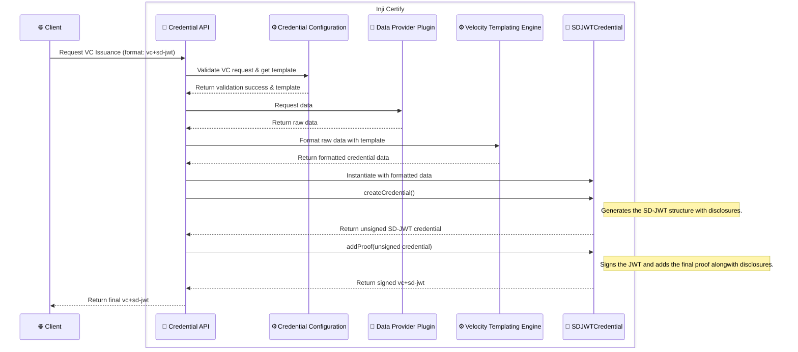

# SD-JWT Credential Support

This document explains how to configure and use SD-JWT (Selective Disclosure JWT) credential format in the Inji Certify service.

---

## 1. How to Configure SD-JWT Credentials

To add a new SD-JWT credential configuration, use the `/credential-configurations` endpoint with the following important fields in your JSON payload:

- **credentialFormat**: Must be set to `vc+sd-jwt`
- **signatureAlgo**: The signing algorithm (e.g., `ES256K`)
- **sdJwtVct**: The VCT (Verifiable Credential Type) value for the credential

For full details on the required fields and how to structure your request with examples, refer to the [Inji Certify API documentation](https://mosip.stoplight.io/docs/inji-certify).

---

## 2. Specific Configurations Required

Add the following properties to your `application.yml` or `application.properties` to enable and control SD-JWT support:

| Property Name                                                          | Description                                                                                                                                                               | Example Value                                      |
|------------------------------------------------------------------------|---------------------------------------------------------------------------------------------------------------------------------------------------------------------------|----------------------------------------------------|
| `mosip.certify.credential-config.credential-signing-alg-values-supported` | Supported signing algorithms for SD-JWT                                                                                                                                   | `{ 'RsaSignature2018': {'RS256'}, 'Ed25519Signature2018': {'EdDSA'}, 'Ed25519Signature2020': {'EdDSA'}, 'EcdsaKoblitzSignature2016': {'ES256K'}, 'EcdsaSecp256k1Signature2019': {'ES256K'}, 'EcdsaSecp256r1Signature2019': {'ES256'}, 'ecdsa-rdfc-2019': {'ES256'}, 'ecdsa-jcs-2019': {'ES256'}}`              |
| `mosip.certify.credential-config.proof-types-supported`                | Supported proof types for SD-JWT                                                                                                                                          | `{'jwt': {'proof_signing_alg_values_supported': {'RS256', 'PS256', 'ES256', 'EdDSA'}}}`                     |
| `mosip.certify.credential-config.cryptographic-binding-methods-supported` | Supported binding methods for SD-JWT                                                                                                                                      | `{ 'ldp_vc': {'did:jwk','did:key'}, 'mso_mdoc': {'cose_key'},'vc+sd-jwt': {'did:jwk','did:key'} }`          |
| `mosip.certify.data-provider-plugin.did-url` | The base Decentralized Identifier document URL used by the data provider plugin to resolve and bind DIDs for credential issuance.                                         | `did:web:someuser.github.io:somerepo:somedirectory` |
|`mosip.kernel.keymanager.signature.kid.prepend`| The prefix to prepend to the `kid` field in SD-JWT credentials. This is useful for ensuring unique key identifiers across different systems. Default value will be blank. | `#`, `<DOMAIN_NAME>#` or `PAYLOAD_ISSUER`                          |
---

## 3. Sequence Diagram for SD-JWT Credential Issuance

## 4. Configuring `kid` and DID Binding

### `kid` (Key ID)
- The `kid` field identifies the keyID of the certificate that is used for signing the VC.
- You can configure the `kid` prefix using the property `mosip.kernel.keymanager.signature.kid.prepend` to ensure uniqueness across different credentials.
  - if you set it to `#`, the `kid` will be prefixed with `#`. example: `#<KEY_ID>`
  - if you set it to `<DOMAIN_NAME>#`, the `kid` will be prefixed with the domain name followed by `#`. example: `example.com#<KEY_ID>`
  - if you set it to `PAYLOAD_ISSUER`, the `kid` will be prefixed with the issuer of the payload. example: `did:example:123#<KEY_ID>`

### DID Binding
- DID binding ensures the credential is cryptographically linked to a Decentralized Identifier (DID).
- The supported binding methods for SD-JWT are `did:jwk` and `did:key` (see configuration above).
- In the final SD-JWT credential, the `cnf` field in payload will contain the holderId in the following format : 
{... cnf": { "kid": "did:jwk:<HOLDER_ID>" ... }}

---

## Notes

- Ensure your signing keys, DIDs are properly registered and accessible to the Certify service.
- For more details on the API, see the [Inji Certify API docs](https://mosip.stoplight.io/docs/inji-certify).

---