# VC Revocation Feature

This document explains how the Credential Status feature works in Inji Certify. This feature lets you revoke or suspend verifiable credentials (VCs) in a privacy-preserving and scalable way, using a W3C-compliant status list.

---

## Overview

With this feature, the system can:

- Issue and manage [BitstringStatusListCredential](https://www.w3.org/TR/vc-bitstring-status-list/) credentials.
- Assign and track a unique status index for each credential.
- Update the status of credentials (for example, to revoke or suspend them).
- Store and retrieve status information efficiently.
- Add status information directly into each issued credential.

---

## Key Data and Storage

- **Status List Credential**: Stores the status list, its purpose (like revocation), and its current state.  
  _Note: The Status List Credential is now managed independently and is not directly tied to the ledger._
- **Ledger**: Keeps a record of each issued credential, including its status and searchable attributes.
- **Credential Status Transaction**: Logs every status change (such as a revocation) for tracking and audit.

**Database tables used:**

- `status_list_credential`
- `status_list_available_indices`
- `ledger`
- `credential_status_transaction`

---

## Status List Credential Structure

A status list credential is a special Verifiable Credential with this structure:

```json
{
   ....
   "@context": [
      "https://www.w3.org/ns/credentials/v2"
   ],
   "credentialStatus": {
      "statusPurpose": "revocation",
      "statusListIndex": "10",
      "id": "https://some.example-service.com/v1/certify/status-list/45564e0c-27c9-4a83-bc87-a0ad1bce79d1#10",
      "type": "BitstringStatusListEntry",
      "statusListCredential": "https://some.example-service.com/v1/certify/status-list/45564e0c-27c9-4a83-bc87-a0ad1bce79d1"
   },
   "proof": { ... },
   ...
}
```

## How It Works
1. **Issuing a Credential with Status**
- When a new credential is issued, the system:
- Finds or creates a status list for the required purpose (like revocation).
- The status list is managed independently and does not require a ledger entry.
- Assigns the next available index in the list to the credential.
- Adds a credentialStatus section to the credential, for example:

```json
"credentialStatus": {
"id": "<status-list-url>#<index>",
"type": "BitstringStatusListEntry",
"statusPurpose": "<revocation>",
"statusListIndex": "<index>",
"statusListCredential": "<status-list-url>"
}
```
- Saves the credential and its status details.

```mermaid
  sequenceDiagram
   participant Client as 🌐 Client
box Inji Certify #E6F3FF
participant CredentialAPI as 🔗 Credential API
participant CredentialConfiguration as ⚙️ Credential Configuration
participant DataProviderPlugin as 🔌 Data Provider Plugin
participant VelocityTemplatingEngine as ⚙️ Velocity Templating Engine
participant W3CJsonLdCredential as 🔐 W3CJsonLdCredential
participant StatusListCredentialService as 📜 StatusListCredentialService
participant Database as 🗄️ Database
end

Client->>CredentialAPI: Request VC Issuance (format: ldp_vc)

CredentialAPI->>CredentialConfiguration: Validate request & get config
CredentialConfiguration-->>CredentialAPI: Return success & config

CredentialAPI->>DataProviderPlugin: Request data
DataProviderPlugin-->>CredentialAPI: Return raw data

CredentialAPI->>VelocityTemplatingEngine: Format raw data with template
VelocityTemplatingEngine-->>CredentialAPI: Return unsigned VC data

CredentialAPI->>W3CJsonLdCredential: Instantiate with unsigned data
W3CJsonLdCredential-->>CredentialAPI: Return unsigned VC object

opt W3C Data Model 2.0 Context is present
CredentialAPI->>StatusListCredentialService: addCredentialStatus(unsigned VC)

note right of StatusListCredentialService: Generate and sign the StatusList VC
StatusListCredentialService->>StatusListCredentialService: Generate BitStringStatusList VC
StatusListCredentialService->>W3CJsonLdCredential: Sign StatusList VC
W3CJsonLdCredential-->>StatusListCredentialService: Return signed StatusList VC

StatusListCredentialService->>Database: Save signed StatusList VC in Status List Credential
Database-->>StatusListCredentialService: Confirm save

note right of StatusListCredentialService: Update original VC with status
StatusListCredentialService->>StatusListCredentialService: Add credentialStatus property to original VC

alt mosip.certify.issuer.ledger.enabled = true
StatusListCredentialService->>Database: Save status details to Ledger
Database-->>StatusListCredentialService: Confirm save
else mosip.certify.issuer.ledger.enabled = false
Note over StatusListCredentialService: Skip saving status details to Ledger
end

StatusListCredentialService-->>CredentialAPI: Return updated unsigned VC
end

CredentialAPI->>W3CJsonLdCredential: addProof(final unsigned VC)
W3CJsonLdCredential-->>CredentialAPI: Return signed VC

CredentialAPI-->>Client: Return final signed ldp_vc

```



2. **Retrieving a Status List**
   - You can fetch a status list credential as JSON using the API endpoint: /credentials/status-list/{id}
   - This operation is independent of the ledger and only requires the status list ID.
   - Sequence diagram for status list retrieval:

```mermaid
sequenceDiagram
   participant Client as 🌐 Client
box Inji Certify #E6F3FF
participant Controller as 🔗 CredentialStatusController
participant Service as ⚙️ StatusListCredentialService
participant Repository as 🗄️ Repository/Database
end

Client->>Controller: GET /credentials/status-list/{id}
Controller->>Service: getStatusListCredential(id)
Service->>Repository: findById(id)
Repository-->>Service: Optional<StatusListCredential>

alt Status List Found
Service->>Service: Parse VC Document
Service-->>Controller: VC Document (JSON)
Controller-->>Client: 200 OK
else Status List Not Found
Service-->>Controller: CertifyException
Controller-->>Client: 404 Not Found
end
```


3. **Updating Credential Status**
   - To change the status (for example, to revoke a credential), use the API endpoint: /credentials/status
   - The system updates the status list independently of the ledger.

   **Provide**:
   - For `/credential/status` - credentialId is mandatory
   - **Request Body for `/credential/status`**:
     ```json
        {
            "credentialId": "9df9fe77-55ac-42f9-b1f1-f2223674fcf1",
            "credentialStatus": {
                "id": "1c6c4caa-47db-47f8-b8e3-12831a384419",
                "type": "BitstringStatusListEntry",
                "statusPurpose": "revocation",
                "statusListIndex": 1,
                "statusListCredential": "09ccbfcf-9edd-4a0a-965d-be3aca7a6baf"
            },
            "status": true
        }
     ```
   - For `/credentials/v2/status` - The credential status details (statusListCredentialId, statusListIndex) inside credentialStatus is mandatory.
   - **Request Body for `/credentials/v2/status`**:
     ```json
        {
            "credentialStatus": {
                "id": "1c6c4caa-47db-47f8-b8e3-12831a384419",
                "type": "BitstringStatusListEntry",
                "statusPurpose": "revocation",
                "statusListIndex": 1,
                "statusListCredential": "09ccbfcf-9edd-4a0a-965d-be3aca7a6baf"
            },
            "status": true
        }
     ```
   - The values for request body can be referenced from [Ledger Search Response](./Ledger-Issuance.md).
- The system records this change for audit and adds the entry in `credential_status_transaction` table.
- Sequence diagram for updating credential status:

```mermaid
sequenceDiagram
   participant Client as 🌐 Client
box Inji Certify #E6F3FF
participant Controller as 🔗 CredentialStatusController
participant Service as ⚙️ CredentialStatusServiceImpl
participant LedgerRepo as 🗄️ LedgerRepository
participant StatusRepo as 🗄️ CredentialStatusTransactionRepository
end

%% v1 endpoint flow
Client->>Controller: POST /credentials/status (credentialId mandatory)
Controller->>Service: updateCredentialStatusV1(request)
Service->>LedgerRepo: findByCredentialId(credentialId)
LedgerRepo-->>Service: Optional<Ledger>
alt Credential Found
Service->>Service: Create CredentialStatusTransaction
Service->>StatusRepo: save(transaction)
StatusRepo-->>Service: CredentialStatusTransaction with timestamp
Service-->>Controller: CredentialStatusResponse
Controller-->>Client: 200 OK
else Credential Not Found
Service-->>Controller: ResponseStatusException (404)
Controller-->>Client: 404 Not Found
end

%% v2 endpoint flow
Client->>Controller: POST /credentials/v2/status (credentialStatus mandatory)
Controller->>Service: updateCredentialStatusV2(request)
Service->>LedgerRepo: findByStatusListCredentialIdAndIndex(statusListCredentialId, statusListIndex)
LedgerRepo-->>Service: Optional<Ledger>
alt Credential Found
Service->>Service: Create CredentialStatusTransaction
Service->>StatusRepo: save(transaction)
StatusRepo-->>Service: CredentialStatusTransaction with timestamp
Service-->>Controller: CredentialStatusResponse
Controller-->>Client: 200 OK
else Credential Not Found
Service-->>Controller: ResponseStatusException (404)
Controller-->>Client: 404 Not Found
end
```


4. **Status List Update Batch Job**
   - The batch job processes status changes and updates the status lists independently.
   - Ledger entries are not required for status list updates.
   - Sequence diagram for the batch job:

```mermaid
  sequenceDiagram
   participant Scheduler as ⏰ Scheduled Task
   participant BatchJob as 🔄 Batch Processor
   participant TransactionDB as 📋 Status Changes
   participant StatusDB as 📜 Status Lists
   Note over Scheduler: Runs every minute
   Scheduler->>BatchJob: Start processing status updates
   alt Feature disabled
      BatchJob-->>Scheduler: Skip processing
   else Feature enabled
      BatchJob->>TransactionDB: Get pending status changes
      TransactionDB-->>BatchJob: List of changes
      alt No changes pending
         BatchJob-->>Scheduler: Nothing to process
      else Changes found
         BatchJob->>BatchJob: Group changes by status list
         BatchJob-->>BatchJob: Organized groups
         loop For each status list
            BatchJob->>BatchJob: Process status list updates
            BatchJob->>StatusDB: Find status list
            StatusDB-->>BatchJob: Status list document
            alt Status list missing
               BatchJob-->>BatchJob: Report error
            else Status list found
               BatchJob->>BatchJob: Calculate new status values
               BatchJob-->>BatchJob: Updated positions
               BatchJob->>BatchJob: Update the bit string
               BatchJob-->>BatchJob: New encoded list
               BatchJob->>BatchJob: Update credential document
               Note over BatchJob: Modify the credential data
               Note over BatchJob: Update timestamps
               BatchJob->>BatchJob: Re-sign the credential
               BatchJob-->>BatchJob: Signed credential
               BatchJob->>StatusDB: Save updated credential
               StatusDB-->>BatchJob: Confirmation
               Note over BatchJob: Mark changes as completed
               BatchJob->>TransactionDB: Update transaction status
               TransactionDB-->>BatchJob: Confirmation
            end
         end
         BatchJob-->>Scheduler: Processing complete
      end
   end
```



## Configuration Properties
| Property Name                                                       | Description                                                                                             | Example Value          |
|---------------------------------------------------------------------|---------------------------------------------------------------------------------------------------------|------------------------|
| `mosip.certify.status-list.signature-crypto-suite` | Signature Crypto Suite for signing Status List VCs                                                      | `Ed25519Signature2020` |
| `mosip.certify.status-list.signature-algo` | Supported signing algorithms for signature crypto suite defined above.                                  | `EdDSA`                |
| `mosip.certify.statuslist.size-in-kb`                | Supported proof types for credentials.                                                                  | `16`                   |
| `mosip.certify.data-provider-plugin.credential-status.allowed-status-purposes`                                     | Set the default values as list that can be allowed for `credentialStatusPurpose` in `credential_config` | `{'revocation'}`          |

## Enabling the Feature
1. Database Setup: Make sure the following tables exist:
   - status_list_credential
   - status_list_available_indices
   - ledger
   - credential_status_transaction
2. Configuration: Set the required properties as shown above.
3. Credential Configuration: For each credential type that should support revocation, set the credentialStatusPurposes field (e.g., to revocation) in the credential-configuration API using the /credential-configurations endpoint. The value of credentialStatusPurposes must be one of the values configured in `mosip.certify.data-provider-plugin.credential-status.allowed-status-purposes`. This enables VC Revocation functionality at the credential-type level.

   **Sample request to enable revocation for a credential type**:
    ```json
    {
      "credentialFormat": "ldp_vc",
      "credentialTypes": ["FarmerCredential", "VerifiableCredential"],
      "contextURLs": ["https://www.w3.org/ns/credentials/v2"],
      "signatureCryptoSuite": "Ed25519Signature2020",
      "credentialStatusPurposes": ["revocation"],
      ...
    }
    ```
4. **API Usage**:
- Use /credentials/status-list/{id} to fetch status list credentials.
- Use /credentials/status to update the status of a credential.
- Use /ledger-search to retrieve credentials and their status information.

- For more details on the API endpoints and request/response formats, refer to the Inji Certify API documentation.

For more details on the API endpoints and request/response formats, refer to the [Inji Certify API documentation](mosip.stoplight.io).

## Notes
- The Status List Credential is now independent of the ledger.
- Only the `BitstringStatusListCredential` type is supported.
- To activate this feature, you must configure the application with the required properties. Without these, the feature will not work.
- The size of each status list can be configured.
- Only the described flows and fields are implemented. This feature is currently in experimental mode and may change in future releases.

## References
- [W3C VC Status List 2021](https://www.w3.org/TR/vc-bitstring-status-list/)
- [VC Data Model v2](https://www.w3.org/TR/vc-data-model-2.0/)