# VCIssuance vs DataProvider Plugin

Certify has a plugin model to issue VCs so that implementors can extend Inji Certify to issue various VCs and and the plugin can be of two types.

1. VCIssuancePlugin
2. DataProviderPlugin

While they are two types of Issuing Plugins, both types are issuing VCs by connecting to a configured datasource. The two types of Plugins enable Inji Certify to operate differ in where VC Signing happens.

```mermaid
sequenceDiagram
    participant Client as 🌐 Client
    box Inji Certify #E6F3FF
    participant CredentialAPI as 🔗 Credential API
    participant CredentialConfiguration as ⚙️ Credential Configuration
    participant VelocityTemplatingEngine as ⚙️ Velocity Templating Engine
    participant CredentialFactory as 🏭 Credential Factory
    participant ProofGeneratorFactory as 🏭 Proof Generator Factory
    end
    participant VCIssuancePlugin as 🔌 VC Issuance Plugin
    participant DataProviderPlugin as 🔌 Data Provider Plugin
    
    Note over VCIssuancePlugin: External Plugin
    Note over DataProviderPlugin: External Plugin

    Client->>CredentialAPI: Request VC Issuance (OIDC4VCI)
    CredentialAPI->>CredentialConfiguration: Validate request & get config (includes credential format)
    CredentialConfiguration-->>CredentialAPI: Return config (with signatureCryptoSuite, credentialFormat)

    alt Using VCIssuancePlugin
        CredentialAPI->>VCIssuancePlugin: Forward Request with config
        Note right of VCIssuancePlugin: Internal Process:<br/>1. Get Data<br/>2. Create VC<br/>3. Sign VC (plugin may use its own format/signing)
        VCIssuancePlugin-->>CredentialAPI: Return Complete Signed VC

    else Using DataProviderPlugin
        CredentialAPI->>DataProviderPlugin: Request Data
        DataProviderPlugin-->>CredentialAPI: Return Raw Data

        CredentialAPI->>VelocityTemplatingEngine: Format raw data with template
        VelocityTemplatingEngine-->>CredentialAPI: Return unsigned credential data

        CredentialAPI->>CredentialFactory: Get credential instance (based on credentialFormat)
        CredentialFactory-->>CredentialAPI: Return credential concrete class

        CredentialAPI->>ProofGeneratorFactory: Select proof generator (based on credentialFormat & signatureCryptoSuite)
        ProofGeneratorFactory-->>CredentialAPI: Return appropriate proof generator

        CredentialAPI->>CredentialFactory: addProof(using selected proof generator)
        CredentialFactory-->>CredentialAPI: Return signed VC

    end
    CredentialAPI-->>Client: Return Final VC (OIDC4VCI)
```

## How to choose to implement either one?

- An integrator can choose to implement VCIssuancePlugin interface if they want to implement the VC Signing by themselves. This gives more power and control to the VC Plugin authors in choosing to support their own formats, signing algorithms which may or may not be supported by Certify.
- There may be a case, where an integrator might want Certify to deal with fewer aspects of VCIssuance or have a pre-existing VC Issuance stack and may just want a Certify as a OpenID4VCI proxy, in this case the implementors can choose to implement VCIssuancePlugin interface which is supposed to give out a valid VC on it's own or with an external stack.
- If an integrator doesn't have an existing VCIssuance stack pre-deployed, they can choose to let Certify do all the heavy lifting with a DataProviderPlugin. They can choose to use any of the sample plugins present in [this repo](https://github.com/mosip/digital-credential-plugins/) or choose to implement their own.

# Doubts?

If you've further questions, do not hesitate to ask a question about the same in [MOSIP Community](https://community.mosip.io)
