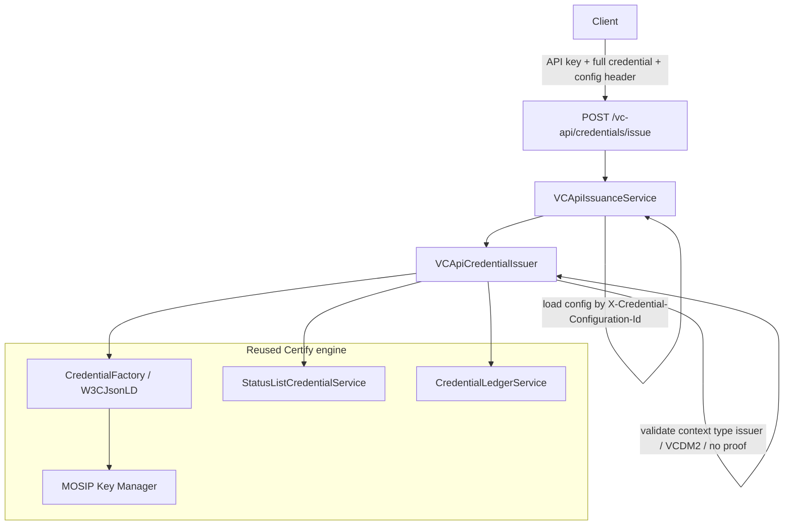
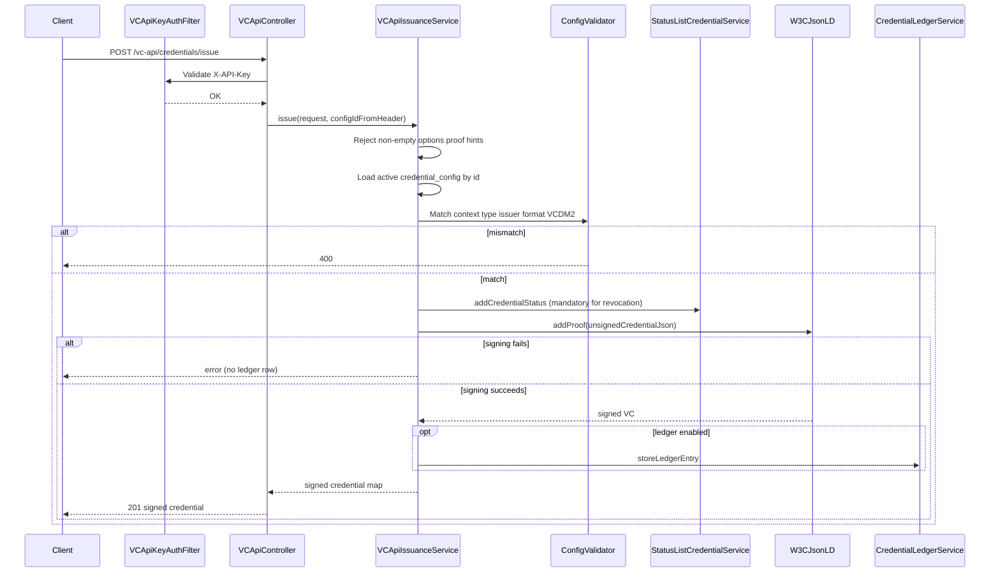

# W3C VC API Support — Issuance (post-20/7 agreement)

Design document for a **parallel** W3C VC API issuance path in Inji Certify, aligned with the
[discussion #884](https://github.com/inji/inji-certify/discussions/884#discussioncomment-17732979)
call dated **20/7/2026**.

---

## 1. Purpose

| Item | Description |
|------|-------------|
| **Consumer** | Client (server-to-server) |
| **Role of Certify** | Validate incoming unsigned credential against onboarded config, then **sign** |
| **Input** | Full unsigned W3C `credential` (VCDM 2.0) + config id header |
| **Output** | Signed credential as the top-level JSON body |
| **Auth** | API key (`X-API-Key`) for this contribution |

---

## 2. Agreed decisions (20/7/2026)

### Core approach

Even though the W3C VC API model assumes the caller sends the full credential (`@context`, `issuer`,
claims, etc.) and the issuer just signs it, **Certify validates** the incoming request against its
own `credential_config` before issuing:

- Values match configuration → issue (sign + return)
- Mismatch → fail (`400`)

### API surface

- **Request/response = W3C-compliant**: endpoint path shape, request payload (`credential` + `options`),
  and response (signed credential as the top-level body) match the W3C VC API issue schema.
- Internal validation logic remains Certify-specific.
- Path: `POST /v1/certify/vc-api/credentials/issue` (prefixed under existing servlet path to avoid
  clashing with `/credentials/status`).

### Credential configuration id

**Chosen for this contribution:** HTTP header  
`X-Credential-Configuration-Id: <credentialConfigKeyId>`

Rationale (from the call): keeps the JSON body identical to the W3C issue schema for best
testbed / interop. Placing the id inside `options` remains an open community discussion point
but is **not** used in this implementation.

The header selects the onboarded issuer profile (signing keys, expected `@context` / `type` /
`didUrl`, format, status purposes). Request `type` alone is not enough because it is not unique
and is caller-controlled.

### Data model

| Item | Status |
|------|--------|
| **VCDM 2.0** | Supported (`https://www.w3.org/ns/credentials/v2`, `validFrom` / `validUntil`) |
| **VCDM 1.1** | **OPEN** — recheck if required for testbed; no code path in this pass |
| **Format** | `ldp_vc` only |

### Scope

- **Issuance only** for this phase.
- Verify / retrieve endpoints: later phases.
- **mDoc via W3C API** — **deferred / needs further exploration**. Direction noted: same issue API,
  full mDoc JSON under `credential` (unsigned), validate against config; response as
  [EnvelopedVerifiableCredential](https://www.w3.org/TR/vc-data-model-2.0/#defn-EnvelopedVerifiableCredential).
  Not implemented here.

---

## 3. API contract

**Feature flag:** `mosip.certify.vc-api.enabled=false` (default off)

```http
POST /v1/certify/vc-api/credentials/issue
X-API-Key: <secret>
X-Credential-Configuration-Id: my-credential
Content-Type: application/json
```

### Request

```json
{
  "credential": {
    "@context": [
      "https://www.w3.org/ns/credentials/v2",
      "https://example.org/examples/v2"
    ],
    "type": ["VerifiableCredential", "FarmerCredential"],
    "issuer": "did:web:example.issuer",
    "validFrom": "2026-01-01T00:00:00.000Z",
    "validUntil": "2028-01-01T00:00:00.000Z",
    "credentialSubject": {
      "id": "did:example:holder",
      "fullName": "Jane Doe"
    }
  },
  "options": {}
}
```

`options` may be omitted or `{}` for W3C request-shape compatibility. Proof hints
(`challenge`, `domain`, `verificationMethod`, `type`, `proofPurpose`, `created`) are **not**
applied by Certify signing. A non-empty value is **hard-rejected** with `400`
(`UNKNOWN_OPTION_PROVIDED`) — these fields are not silently ignored. Config id is **not**
taken from `options` — use `X-Credential-Configuration-Id`.

`validFrom` and `validUntil` follow [VCDM 2.0 validity period](https://www.w3.org/TR/vc-data-model-2.0/#validity-period):
both are optional on the request. If `validUntil` is present, `validFrom` MUST exist and
`validUntil` MUST be later than `validFrom`. [VCALM issue-credential](https://w3c.github.io/vcalm/#issue-credential)
does not require either field; Certify fills gaps so the signed response always includes both:

- omitted `validFrom` → current UTC time
- omitted `validUntil` → `validFrom` + `mosip.certify.data-provider-plugin.vc-expiry-duration` (default `P730D`)

Preferred form is Certify’s UTC pattern `yyyy-MM-dd'T'HH:mm:ss.SSS'Z'` (e.g. `2026-01-01T00:00:00.000Z`).
The parser also accepts common ISO-8601 / VCDM forms via `Instant` parsing (with or without milliseconds,
`Z` or numeric offsets such as `+05:30`; a missing zone is treated as UTC).

### Response (`201 Created`)

```json
{
  "@context": ["..."],
  "type": ["..."],
  "issuer": "did:web:...",
  "validFrom": "...",
  "validUntil": "...",
  "credentialSubject": { "...": "..." },
  "credentialStatus": { "...": "..." },
  "proof": { "...": "..." }
}
```

### Validation rules

| Rule | Outcome |
|------|---------|
| Missing / invalid API key | `401` |
| Missing / blank `X-Credential-Configuration-Id` | `400` |
| Unknown / inactive config id | `400` |
| `credential` missing or empty | `400` |
| `options` present with any non-blank proof hint | `400` |
| Malformed `validFrom` or `validUntil` (not Certify UTC / parseable ISO-8601) | `400` |
| `validUntil` not later than `validFrom` | `400` |
| `credential` already has `proof` | `400` |
| Config `credentialFormat` ≠ `ldp_vc` | `400` |
| `@context` does not include VCDM 2.0 URL | `400` |
| Request `@context` / `type` / `issuer` do not match onboarded config | `400` |
| Missing / empty / `{}` `vcTemplate`, or template without `credentialSubject` | `400` |
| `credentialSubject` keys ≠ template `credentialSubject` keys | `400` |
| Config missing `credentialStatusPurposes` (required for revocation) | `400` |
| Signing / Key Manager / status list failure | `500` |

Errors use [RFC 9457 Problem Details](https://www.rfc-editor.org/rfc/rfc9457.html) /
[VCALM ProblemDetails](https://w3c.github.io/vcalm/#dfn-problemdetails)
(`Content-Type: application/problem+json`), not OpenID4VCI `VCError`
(`error` / `error_description`). `/issuance/` is unchanged.

`type` is a URL (REQUIRED). VCDM 2.0 types are used where the failure is about
processing the credential document. HTTP-layer failures with no W3C issuance type
use `about:blank` and the HTTP reason phrase as `title`.

```json
{
  "type": "https://www.w3.org/TR/vc-data-model-2.0#MALFORMED_VALUE_ERROR",
  "title": "Malformed Value Error",
  "detail": "credentialSubject keys do not match onboarded vcTemplate",
  "status": 400,
  "instance": "/v1/certify/vc-api/credentials/issue"
}
```

| Failure | HTTP | `type` |
|---------|------|--------|
| Unsupported / unknown issue `options` | `400` | `https://www.w3.org/TR/vcalm#UNKNOWN_OPTION_PROVIDED` |
| Malformed JSON body | `400` | `https://www.w3.org/TR/vc-data-model-2.0#PARSING_ERROR` |
| Malformed credential / request / config mismatch | `400` | `https://www.w3.org/TR/vc-data-model-2.0#MALFORMED_VALUE_ERROR` |
| `validUntil` not later than `validFrom` | `400` | `https://www.w3.org/TR/vc-data-model-2.0#RANGE_ERROR` |
| Missing / invalid API key | `401` | `about:blank` |
| Signing / Key Manager / status-list failure | `500` | `about:blank` |

Match semantics:

- **Config load**: by `X-Credential-Configuration-Id` → active `credential_config`
- **VCDM 2.0**: request `@context` must include `https://www.w3.org/ns/credentials/v2`
- **`@context` / `type`**: must match onboarded config (`contextURLs`, `credentialTypes`)
- **`issuer`**: request issuer string (or `issuer.id` if object) must equal config `didUrl`
- **`vcTemplate`**: onboarded template must define `credentialSubject`; request must include
  every template subject key and must not include undeclared keys, except optional JSON-LD
  `credentialSubject.id` (`@id`), which is allowed even when omitted from the Velocity template.
  Template may be raw JSON or Base64-encoded JSON (same as OpenID4VCI).

---

## 4. Flow





### Processing order

```text
1. Authenticate API key
2. Require X-Credential-Configuration-Id
3. Reject unsupported options (non-empty proof hints → 400 UNKNOWN_OPTION_PROVIDED)
4. Load active credential_config by id
5. Reject credential with existing proof
6. Require ldp_vc + VCDM 2.0 context
7. Validate @context / type / issuer against config
8. Validate credentialSubject keys against onboarded vcTemplate
9. Apply validFrom / validUntil (default omitted fields; reject invalid range)
10. Required: add credentialStatus (credentialStatusPurposes on config; enables revocation)
11. W3CJsonLD.addProof using config signing fields (no Velocity rebuild)
12. Validate signed credential is present (JsonLDObject); else fail
13. Optional: ledger metadata (only after valid signed credential)
14. Return 201 with the signed credential as the top-level JSON body
```

**Not used for this API:** `DataProviderPlugin.fetchData`, Velocity evaluation of `vcTemplate` to rebuild
the envelope, eSignet / OAuth holder proof, cNonce.
(`vcTemplate` is used only to **validate** subject field names.)

---

## 5. Package layout

```text
certify-core/
  └── io/mosip/certify/core/
        ├── constants/ProblemDetailsTypes.java
        └── dto/
              ├── VCApiIssueRequest.java
              ├── VCApiIssueOptions.java
              └── ProblemDetails.java

certify-service/
  └── io/mosip/certify/
        ├── controller/VCApiController.java
        ├── services/
        │     ├── VCApiIssuanceService.java
        │     └── VCApiCredentialIssuer.java
        ├── filter/VCApiKeyAuthFilter.java
        └── config/VCApiSecurityConfig.java
```

**Base URL:** `{mosip.certify.domain.url}/v1/certify/vc-api/...`  
(`server.servlet.path=/v1/certify`)

---

## 6. Configuration

| Property | Purpose |
|----------|---------|
| `mosip.certify.vc-api.enabled` | Feature flag (default `false`) |
| `mosip.certify.vc-api.api-keys` | Comma-separated API keys |
| CSRF ignore | `/vc-api/**` on `mosip.certify.security.ignore-csrf-urls` |

Docker Compose (`docker-compose/docker-compose-injistack/config/certify-default.properties`) enables the API
with `mosip.certify.vc-api.enabled=true` and `mosip.certify.vc-api.api-keys=local-dev-secret`.

Prerequisite: credential type onboarded via `POST /credential-configurations` with matching
`contextURLs`, `credentialTypes`, `didUrl`, and signing key fields (`keyManagerAppId`,
`keyManagerRefId`, `signatureAlgo`, `signatureCryptoSuite`).

---

## 7. Operator checklist

1. Key Manager keys provisioned.
2. Onboard credential configuration (VCDM 2.0 contexts + types + `didUrl` + signing fields).
3. Host `did.json` from `GET /.well-known/did.json`.
4. Enable `mosip.certify.vc-api.enabled=true` and configure API keys.
5. Client calls `POST /vc-api/credentials/issue` with
   `X-Credential-Configuration-Id`, full unsigned credential, and matching
   `@context` / `type` / `issuer` against that config.

---

## 8. Out of scope (this contribution)

- VCDM 1.1 issuance
- mDoc / enveloped VC over W3C API
- `GET /vc-api/credentials/{id}`, verify endpoints
- Replacing API key auth with OAuth client credentials
- Claim-level value typing / schema beyond `credentialSubject` key match to `vcTemplate`
