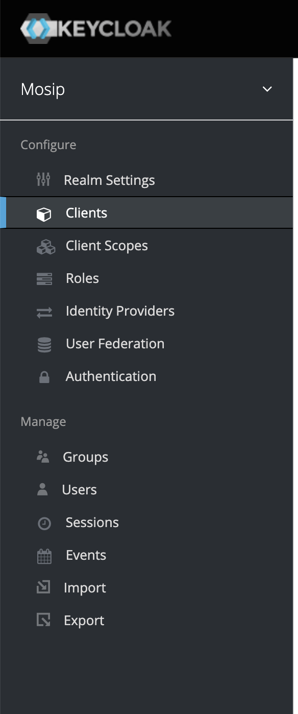

# Implementing Certify for your own Identity System using a DataProvider Plugin Implementation

## Goals:

- Taking a relevant release of Inji Certify with/without other relevant/related compatible components to issue Verifiable Credentials.
- This document is a good first place to start looking for configuration just to **kick the tires**. There'd be way many compliance checks & certifications required for a Production deployment which is out of the scope of this document.

## Non Goals:

- Writing a new Certify VC Plugin
- Security compliance/guidelines/safeguards from PoV of a Production deployment targeting a larger population.

## Pre-requisite:

1. A configured Keycloak setup.
2.

## Steps

### 1. Keycloak Configuration

1. Login into Keycloak and create a "Client" in Keycloak, check for the "Clients" option on the sidebar as shown in 
    - the "Access Type" should be `public`
    - add "Valid Redirect URIs" to the appropriate values or keep it to `*` for testing purposes, do change it later
    - set "Enabled" to true
    - configure
2. Create a "client scope" in Keycloak with the same scope name as the one configured in Certify Well Known
    - set the "Protocol" to be `openid-connect`
    - set "Include In Token Scope" to `true`
    - Create mappers with the "token claim name" of `c_nonce_expires_in`, `aud`, `client_id`, `c_nonce` with the "Add to access token" set to `true`

### 2. Configure Certify

1. Set the Authorize URL of Certify to point to the KeyCloak Authorization server, i.e. `mosip.certify.authorization.url` and configure the `mosip.certify.authn.issuer-uri` & `mosip.certify.authn.jwk-set-uri` appropriately.
2. Configure `mosip.certify.identifier` to the value matching the `aud` value configured in the client.
3. Configure the scope correctly as per the scope of the VerifiableCredential as configured in the Keycloak client in the prior steps.
4. Configure the credential types to match the VC in the well known
5. Add and configure your VC Plugin and configure it's properties
6. Generate an Authorization token via Keycloak and make